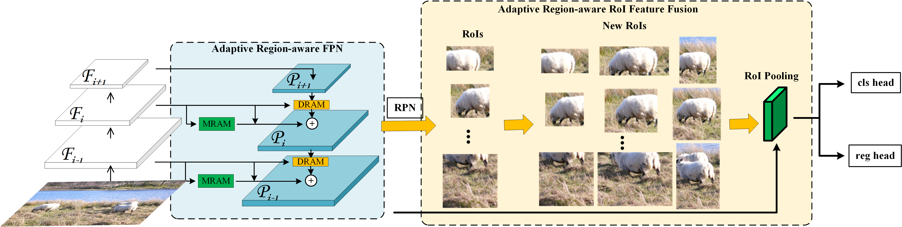
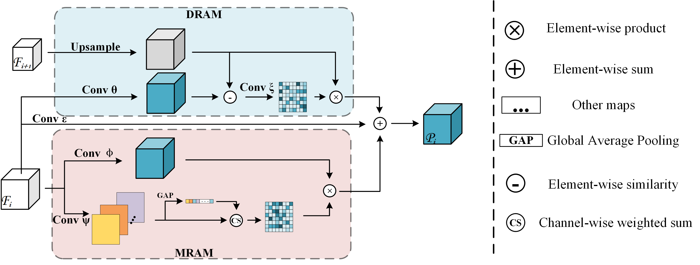
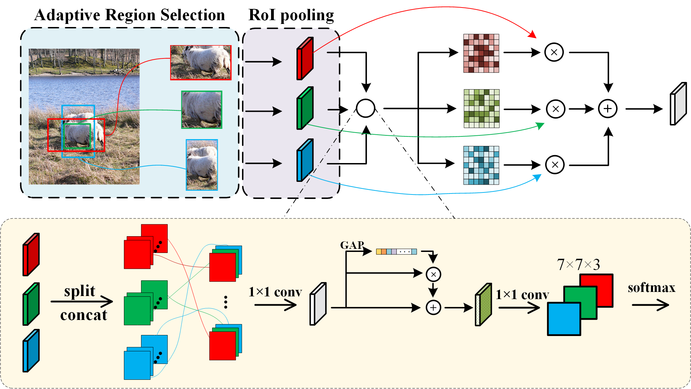

# Adaptive Region-aware Feature Enhancement for Object Detection
This repository implements [ARFE]() (our method) on the base of [mmdetection](https://github.com/open-mmlab/mmdetection) structure. Please follow [mmdetection](https://github.com/open-mmlab/mmdetection) on how to install and use this repo.

This repo has released AR-FPN module and AR-RFF module, and our methods deliver substantial performance gains and strong generalization capability compared to others.

The implementation of ARFE is very simple, but it can boost the performance 1.7% AP in FPN(resnet50) at least.

# ARFE
AR-FPN can be readily plugged into existing FPN-based models and improve performance. In addition, AR-RFF module can be used in arbitrary two-stage anchor-based detectors.

### AR-FPN module structure

### AR-RFF module structure

